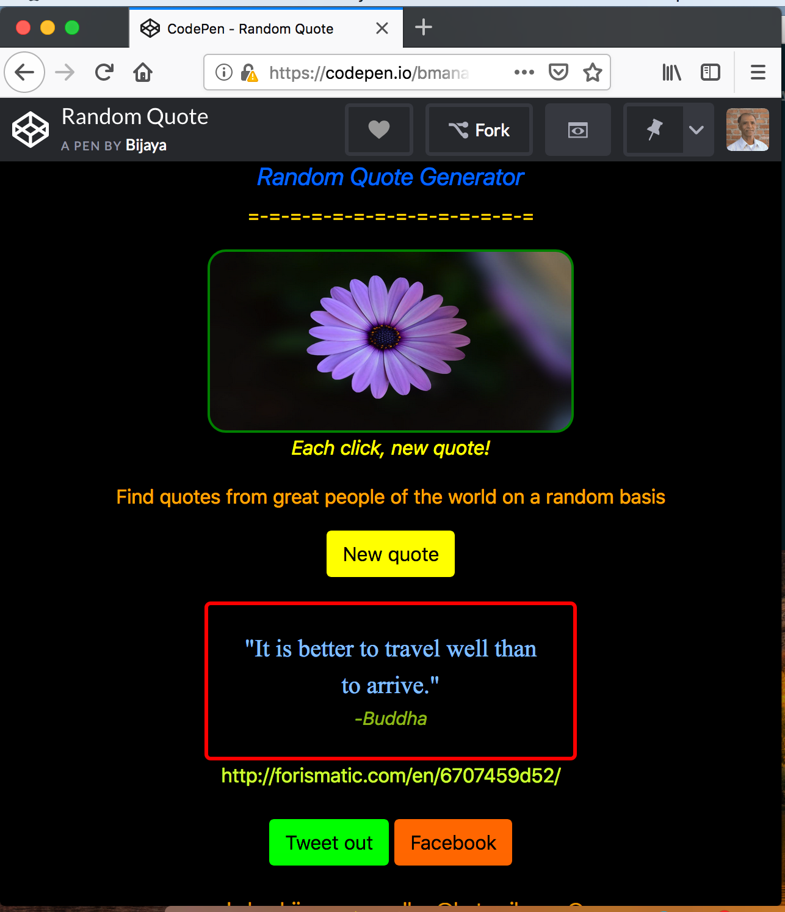

<a href="https://codepen.io/bmanandhar/full/wyKJrY">Launch</a> this web application on Codepen respository.

### Inspiring Random Quotes 

This web application has been made available to public to read and learn several inspiring quotes randomly that were delivered by numerous great personalities of the world. It displays quotes and respective authors. If data does not contain author name, it will display 'Anomymous' as author name. 

*Functionality*

* Web entry point being `index.html` file, upon opening this file, all the functionalities get triggered that are linked to this file, mainly the `script.js` file that contains the code base written in JavaScript using Jquery library.

* `index.html` and `style.css` combined will display a web page having a prompting window, buttons, images and texts on the browser. 

* Once the "New quote" button is clicked, the `script.js` will get activated and accesses the public API data library <a href="http://forismatic.com/en/">http://forismatic.com/en/</a> to reneder the randomly generated data containing quote, author name, and URL of data in the cloud.

* the data then can be sent directly to Facebook and/or Tweeter for posting, if the user wants. 

* User can click the `New quote` button anytime if new data is required.

*Challenges*

* Styling the webpage
* Writing the `script.js` file

*Screenshot Image*

* Random Quote

<!--
https://codepen.io/bmanandhar/pen/wyKJrY
https://codepen.io/bmanandhar/full/wyKJrY
-->
